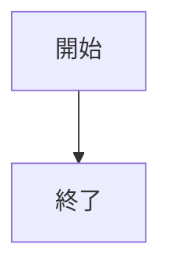
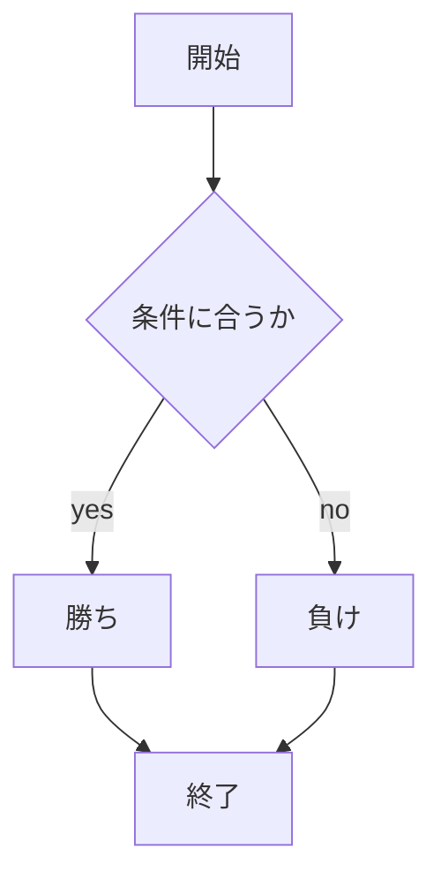

# webpro_06

## app5.jsについて

## ファイル一覧

ファイル名 | 説明
-|-
app5.js | プログラム本体
public/janken.html | じゃんけんの開始画面
views/janken.ejs | じゃんけんのテンプレートファイル


1.適切なディレクトリに移動した上で，```node app5.js```を入力しプログラムを起動する
2.Webブラウザで```local:8080/public/janken.html```にアクセスする
3,自分の手を入力する





## 追加したプログラム

1.適切なディレクトリに移動した上で，```node app5.js```を入力しプログラムを起動する
2.Webブラウザで```local:8080/public/dododo```にアクセスする
3,小文字の1~10の数字を入力する

### 作成したプログラムの詳細
コンピュータが数字の1から10の数字をランダムに選択するので，
その中からどれか数字を選択し，数字を当てるゲームである．
大文字で1から10の数字を入力しても，認識されないので，
注意が必要である．

